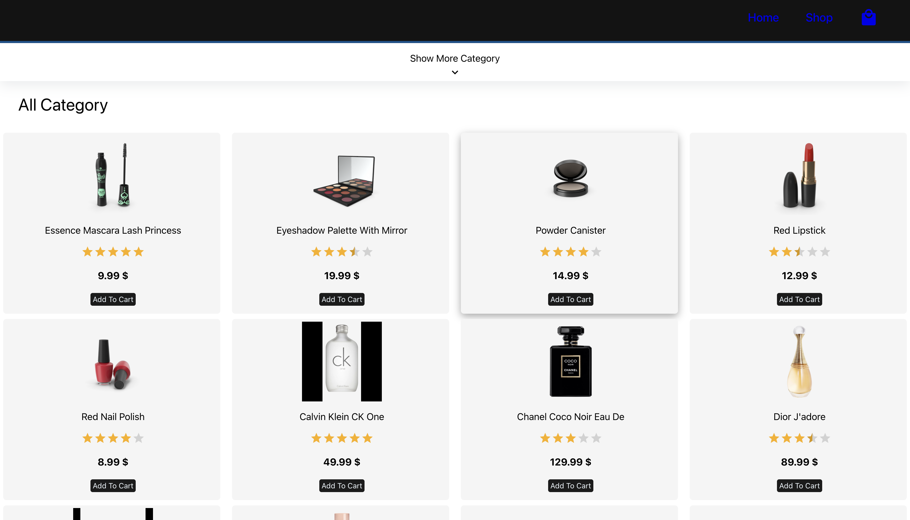

# **Sanix** 🛒  
*A sleek and minimal shopping cart app powered by React and the FakeStore API.*

## **Table of Contents**  
- [Features](#features)  
- [Demo](#demo)  
- [Installation](#installation)  
- [Usage](#usage)  
- [Technologies](#technologies)  
- [Contributing](#contributing)  
- [License](#license)  

## **Features**  
✅ Browse products from the [FakeStore API](https://fakestoreapi.com)  
✅ Add and remove items from your cart  
✅ Modify item quantity inside the cart  
✅ View total cost and item count  
✅ Persist cart state using localStorage  
✅ Clean and responsive layout using **CSS Modules**  

## **Demo**  
🔗 **Live Demo:** [Sanix Cart App](https://shoppingcartsanix.netlify.app/)  

📸 **Screenshots:**  


## **Installation**  
To run the project locally:  
```sh
git clone https://github.com/ClementZambon/sanix.git  
cd sanix  
npm install  
npm run dev  
```

## **Usage**  
1. Open the app in your browser.  
2. Browse through the list of products.  
3. Add products to your cart by clicking the "Add to Cart" button.  
4. Click the cart icon to view your cart.  
5. Adjust item quantities or remove products.  
6. Your cart stays saved even if you refresh the page (thanks to localStorage!).  

## **Technologies**  
🛠 **Frontend:**  
- React  
- CSS Modules  
- Fetch API  
- Vite  

📦 **API:**  
- FakeStore API  

🧪 **Dev Tools:**  
- Vite Dev Server  
- ESLint  
- Prettier  

## **Contributing**  
Contributions are always welcome!  

Steps:  
1. Fork this repo  
2. Create a new branch (`git checkout -b feature/your-feature`)  
3. Commit your changes  
4. Push the branch  
5. Open a pull request  

Let's keep improving Sanix together 💥  

## **License**  
📜 MIT License  

This project is licensed under the MIT License. See the LICENSE file for full details.
